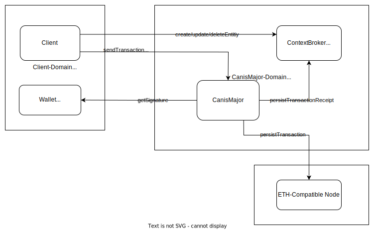

[](https://www.fiware.org/developers/catalogue/)
[](https://bestpractices.coreinfrastructure.org/projects/4661)
[](https://opensource.org/licenses/Apache-2.0)
[](https://quay.io/repository/fiware/canis-major?tab=tags)
-------
# CanisMajor - FIWARE DLT Adaptor

CanisMajor is a blockchain adaptor that supports persistence and verification of [NGSI-LD](https://docbox.etsi.org/isg/cim/open/Latest%20release%20NGSI-LD%20API%20for%20public%20comment.pdf) Entity-Transactions(e.g. create/delete/update- operations) in blockchains. 


This project is a part of [FIWARE](https://github.com/fiware). For more check the FIWARE catalog entry for (..).

| :books: [Documentation](https://fiware.github.io/CanisMajor/) | :mortar_board: [Academy](https://github.com/fiware/tutorials.Step-by-Step) | :whale: [Docker Hub](https://hub.docker.com/r/singhhp10691/canismajor) | :dart: [Roadmap](https://github.com/fiware/CanisMajor/blob/master/roadmap.md) |
| --------------------------------------------------------------------- | ------------------------------------------------------------------------------------------ | ---------------------------------------------------------- | --------------------------------------------------------------------------- |

## Overview



In order to persist transactions inside the blockchain, a client has to send information about its transactions(e.g. create/update/delete entity) to CanisMajor. 
The request should include information about the Wallet(e.g. Keystore) to be used for signing the transaction. Please check the [API](./api/api.yaml)(tag `NGIS-LD`) on how to 
send the transactions and provide the Wallet-Information. CanisMajor will create a [Merkle-Tree](https://en.wikipedia.org/wiki/Merkle_tree) from the send informations 
and include it as data into the transaction for the Blockchain. In order to properly sign the transaction, CanisMajor uses the provided Wallet-Information and delegates the
signing to the client's Wallet. The signed transaction is then put into the Oketh-compatible blockchain.

## Testing 

Run unit-tests via: ```mvn clean test```

A set of integration tests(using [cucumber](https://cucumber.io/)) is available under [it/](./it). 
To run them use:
```shell
    cd it
    docker-compose -f docker-compose/docker-compose-env.yaml -f docker-compose/docker-compose-java.yaml up
    mvn clean test
```


## ADRs

* [Delegate transaction signing to the client](docs/adrs/delegate-signatur.md)


## License

CanisMajor is licensed under the Apache License, Version 2.0. See [LICENSE](https://github.com/fiware/CanisMajor/blob/master/LICENSE) for the full license text.

© 2021 FIWARE Foundation e.V.
