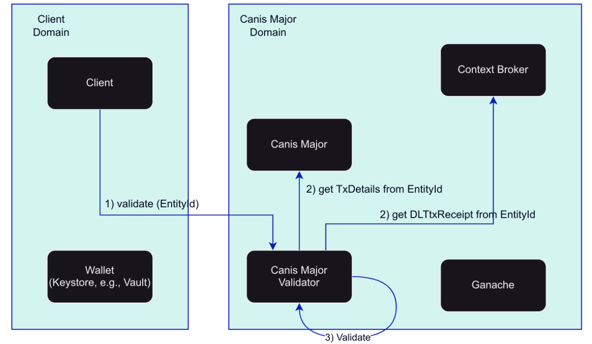

# Validation service

The validation service for Canis Major performs security checks to verify transaction integrity between the context broker and Canis Major blockchain transactions.

## Service Setup
The validation service implements a three-step verification protocol.

### Initial Validation Request
The client initiates the verification process by submitting a POST request to the Canis Major Validator service. 

### Dual-Source Data Retrieval
The Canis Major Validator executes two GET requests, based on the `entityId`,  to:
- Canis Major
- The Context Broker 

Both requests retrieve the entity information using the specified entity identifier as the query parameter.

### Data Integrity Analysis
The validator performs a systematic comparison of the entity representations obtained from both sources. 
