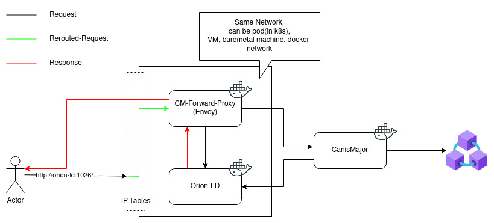

# Forward Proxy

The CanisMajor-Forward-Proxy is intended to work as a [Sidecar](https://www.oreilly.com/library/view/designing-distributed-systems/9781491983638/ch02.html) to the [NGSI-LD](https://docbox.etsi.org/isg/cim/open/Latest%20release%20NGSI-LD%20API%20for%20public%20comment.pdf) [ContextBroker](https://github.com/FIWARE/context.Orion-LD),
to transparently integrate it with CanisMajor. It transparently forwards request intended for the broker to CanisMajor, while continuing the request to the broker. Depending on the configuration, this
can either be a "best-effort"-forwarding, where the request to the broker is continued independently of the request to CanisMajor. Or it can be a "strict"-forwarding, where every request is put on hold until its successfully responded by CanisMajor.



The diagram above describes the architecture integration of the Forward Proxy. It needs to be co-located inside the same network as the broker, in order to make use of 
[ip-tables](https://linux.die.net/man/8/iptables) to intercept requests and forward them to the proxy. The proxy itself is setup as a [Wasm-filter](https://www.envoyproxy.io/docs/envoy/latest/api-v3/extensions/filters/http/wasm/v3/wasm.proto)
for extending [envoy](https://www.envoyproxy.io). It can either be run as dedicated container(see [cm-forward-proxy](https://quay.io/repository/fiware/cm-forward-proxy)) or integrated into an envoy-based service-mesh(see [cm-forward-proxy](https://quay.io/repository/fiware/cm-forward-filter-extension)).

## Local setup

In order to run the whole service in a local environment, a docker-compose setup is provided. 

> :warning:  The dev setup relies on [iptable](https://linux.die.net/man/8/iptables) manipulation 
> in order to intercept requests and forward them to the proxy. If the OS does not support that, you 
> need to configure that individually.


## Setup


The development-setup runs on a dedicated network with fixed ip-addresse to allow the iptables-manipulations defined in [iptables.sh](./docker-compose/iptables.sh).
This script can be used to setup the iptables to redirect everything that is send to 1026 on that networks ip-range to 15001. This will redirect the traffic
intended for the broker to envoy. It also includes a rule to RETURN everything from the root-userspace, in order to jump out of envoy and
not potentially harm the whole host. If those configurations do not fit your needs, you need to setup up such behaviour differently
depending on your system.

The setup includes the following components:


### Service-Components

* CM-Forward-Proxy: the actual proxy component. Uses an init-script to copy initial config from [initial-config](./docker-compose/initial-config).
* CanisMajor: CanisMajor to receive and handle the requests from the proxy
* Orion-LD + MongoDB: the broker as request-target and for storing the transaction-receipts
* Ganache + AEI-Contract: ethereum-compatible test system to provide blockchain and smart-contract functionality required for CanisMajor

## Execution

To start-up the environment run ```docker-compose up``` inside the [docker-compose folder](./docker-compose). Then execute the [iptables.sh](./docker-compose/iptables.sh) to set up the port-redirection(needs to be run as root).
The configuration of the setup runs the proxy in "best-effort"-mode. If "strict" should be used, set the plugin-configuration in envoys' [listener-config](./docker-compose/initial-config/listener.yaml#L38) to ```strict:true```

A request scenario will use the following path:

1. Client sends NGSI-Request to Orion-LD 
```console
   curl --request POST 'http://10.5.0.5:1026/ngsi-ld/v1/entities' \
        --header 'Content-Type: application/ld+json' \
        --data-raw '{
                        "id": "urn:ngsi-ld:AirQualityObserved:Porto-AmbientObserved-28079004-2016-03-18T17:00:00",
                        "type": "AirQualityObserved",
                        "CO": {
                            "type": "Property",
                            "value": 501,
                            "unitCode": "GP"
                        },
                        "CO_Level": {
                            "type": "Property",
                            "value": "moderate"
                        },
                        "@context": ["https://uri.etsi.org/ngsi-ld/v1/ngsi-ld-core-context.jsonld", "https://raw.githubusercontent.com/smart-data-models/dataModel.Environment/master/context.jsonld"]
                       }'
```

2. IP-Tables will reroute the request to the proxy

3. The proxy will(in parallel):
   a. forward the request to CanisMajor
   b. passthrough the request to the broker

4. The proxy will passthrough the response to orion

5. CanisMajor persists the request in the blockchain

6. CanisMajor stores the transaction receipt in the broker

7. Check with:
```console
    curl --request GET 'http://10.5.0.4:4000/entity/urn:ngsi-ld:AirQualityObserved:Porto-AmbientObserved-28079004-2016-03-18T17:00:00'    
```
