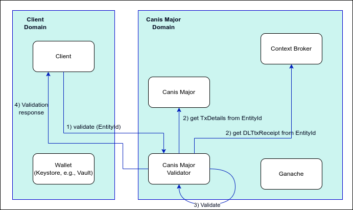

# Validation service

## Overview
The Validation Service is a microservice that verifies transaction data integrity between Orion-LD Context Broker and Canis Major DLT Adapter. It provides a REST API for validating that blockchain transaction data maintains its integrity across both systems, performing security checks to ensure the authenticity and consistency of transaction records  and that the transaction information has not been tampered with or corrupted when stored in the DLT.

## Validation Process
The validation service architecture 

The diagram shows the flow of transaction validation between the Client Domain and Canis Major Domain:

- The process begins when a client initiates validation by sending a request with an Entity ID to the Canis Major Validator

- The validator retrieves transaction details from both Canis Major and the Context Broker

- The validator performs integrity checks on the transaction data

- The validation results are returned to the client

## Validation Checks
The Canis Major Validator performs a comprehensive field-by-field comparison of transaction data obtained from both the Context Broker and Canis Major.

The service executes the following data integrity verifications:

1. **Status Check**
   - Verifies if the transaction status matches between both systems.

2. **Block Information**
   - Confirms block number consistency.
   - Validates block hash matches.

3. **Transaction Details**
   - Ensures transaction hash is identical. The hash functions as a digital fingerprint that uniquely identifies a transaction. Any alteration to the transaction data, no matter how small, would result in a completely different hash.
   - Verifies sender ("from") address matches.
   - Confirms recipient ("to") address is consistent.

> [!NOTE]
>
> Each validation failure generates a specific discrepancy record containing:
> - The field name where the mismatch occurred
> - The value reported by Orion-LD
> - The value reported by Canis Major

